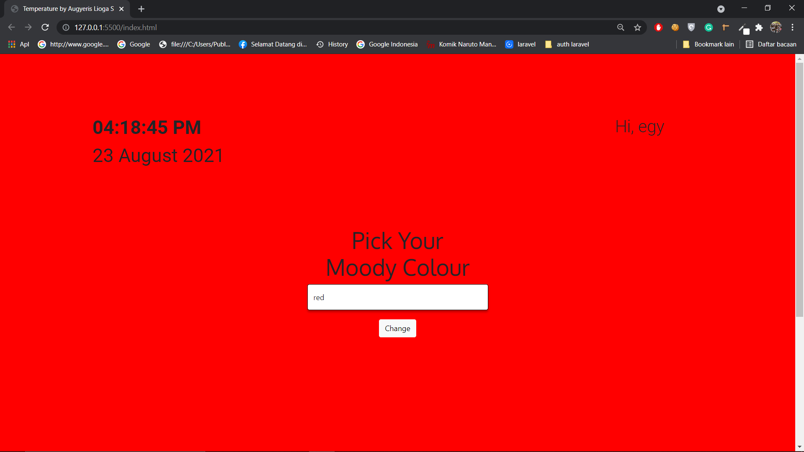

### Homework Javascript 1 Temperature Calculator
#### Made by Augyeris Lioga Seandrio

##### 1. First picture

##### 2. Second picture

Feature :
1. Change background-color
2. Time real-time update
3. Temperature Calculator include: Reaumur, Fahrenheit, and Celcius
4. Input username

Made with: Moment.js, js, HTML, and CSS

